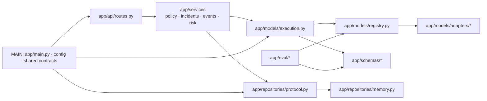
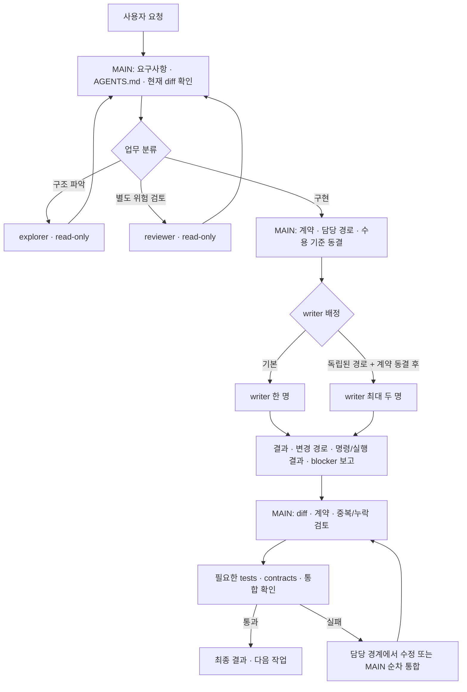

# ai_477_camera Codex 실행 에이전트 아키텍처

- 작성일: 2026-10-09
- 범위: `ai_477_camera` 저장소에서 사용하는 Codex 실행 환경, 사용자 정의 에이전트 구성, 위임·통합 흐름
- 기준 저장소: `C:\Users\user\python_project\477_ai_pr\ai_477_camera`
- 성격: 현행 설정과 저장소 문서에 근거한 분석 및 권장 운영 설계

## 요약

이 저장소는 하나의 메인 Codex 에이전트가 업무를 분해하고 결과를 통합하며, 다섯 개의 사용자 정의 역할(`explorer`, `reviewer`, `model_engineer`, `evaluation_engineer`, `backend_engineer`)에 제한된 읽기 또는 쓰기 작업을 위임하는 구조다. 전역 설정은 에이전트 기능과 도구 연결을 제공하고, 저장소 설정은 프로젝트별 동시 실행 한도를 정하며, `AGENTS.md`와 소유권 표가 실제 협업 규칙을 제공한다.

권장 운영은 **읽기 전용 탐색·리뷰를 필요한 때 병렬로 수행하고, 기본은 writer 한 명만 작업하며, 계약을 동결한 뒤에만 서로 겹치지 않는 두 writer를 제한적으로 병렬 실행하는 것**이다. 메인 에이전트가 공유 파일 변경, 통합, 검증, 최종 보고를 소유한다. 현재 역할 TOML의 모델 고정은 계정 모델을 상속하라는 저장소 정책과 충돌하므로 의도적으로 고정하는지 정리할 필요가 있다.

## 1. 확인한 실행 환경

| 계층 | 확인된 설정 | 역할 |
|---|---|---|
| Codex 설치 | `codex-cli 0.161.0` | 사용자 PC에서 확인한 CLI 버전. 계정 권한과 실제 프로필 로딩은 별도 확인 대상이다. |
| 사용자 전역 `~/.codex/config.toml` | 기본 모델 `gpt-6-luna`, reasoning `high`, Windows sandbox `elevated`, 프로젝트 trust 항목, hooks 활성화 | 모델 기본값, Windows 실행 정책, 프로젝트 신뢰, MCP·플러그인과 훅 등록의 기반 |
| Codex 에이전트 설정 | `[agents] enabled = true`, `max_concurrent_threads_per_session = 3`, `interrupt_message = true` | 세 개의 spawned-agent thread까지 허용. 이 값은 저장소의 동시 writer 정책을 대신하지 않는다. |
| 프로젝트 `.codex/config.toml` | 에이전트 기능 활성화, 동시 thread 한도 3, interrupt message 활성화 | 저장소에 적용되는 실행 한도 |
| 프로젝트 `.codex/agents/*.toml` | 다섯 역할 프로필 | 역할별 업무 설명, 모델·reasoning, sandbox 기본값과 상세 지침 |
| 저장소 `AGENTS.md`, `docs/ownership.md` | 공통 파일은 MAIN 소유, writer 범위 분리, 기본 한 명만 작성, 중첩 위임 금지 | 변경 충돌을 줄이는 프로젝트 운영 규칙 |
| 사용자 전역 hooks | `SessionStart`, `UserPromptSubmit`, `PreToolUse`, `PostToolUse`, `PreCompact`, `Stop`에서 context-mode hook 실행 | 세션·도구·압축 전후의 context-mode 연동 |
| MCP | context-mode 서버와 도구 승인 설정 | 검색·배치 실행·파일 분석으로 긴 원문을 세션 문맥에 직접 싣지 않고 조사 |

Codex 설정 파일은 실제 유효 설정의 전부를 보장하지 않는다. 관리 정책과 실행 중 권한 변경, 계정·조직의 모델 접근 여부가 결과에 영향을 줄 수 있다. 현재 프로젝트의 trust 항목은 존재하지만, 이 분석에서 계정 모델 접근이나 모든 역할 프로필의 실제 spawn 성공을 확인하지는 않았다.

## 2. 역할과 경계

| 역할 | 설정된 기본 모델 / reasoning | 설정 sandbox | 소유 범위와 책임 |
|---|---|---|---|
| MAIN | 사용자 대화의 메인 에이전트 | 세션의 유효 권한 | 요청 분해, 공통 계약·스키마·registry·execution, 프로젝트 문서와 설정, writer 배정, 통합·검증·최종 보고 |
| `explorer` | `gpt-6-luna` / `high` | `read-only` | 저장소 구조와 통합 경로를 조사하고 경로 근거를 반환 |
| `reviewer` | `gpt-6.1-sol` / `high` | `read-only` | 계약·실패 처리·누수·통합을 검토하고 PASS/BLOCK 근거를 반환 |
| `model_engineer` | `gpt-6.1-sol` / `high` | `workspace-write` | `app/models/adapters/**`, `tests/models/**` 안에서 한 번에 한 adapter 구현 |
| `evaluation_engineer` | `gpt-6.1-sol` / `high` | `workspace-write` | `app/eval/**`, `tests/eval/**`의 manifest, metrics, 평가 실행기 |
| `backend_engineer` | `gpt-6.1-sol` / `medium` | `workspace-write` | `app/api/**`, `app/services/**`, memory repository와 backend 테스트 |

역할 설명과 지침은 agent routing을 돕지만 경로 권한을 완전히 강제하지는 않는다. 저장소 지침도 별도 대화가 같은 작업 폴더를 공유할 수 있다고 명시한다. Codex 공식 문서는 사용자 정의 agent가 지정한 sandbox가 기본값이며, 부모 세션에서 실시간으로 바꾼 권한이 자식에 다시 적용될 수 있다고 설명한다. 따라서 역할의 `developer_instructions`를 보안 경계로 간주하지 말고, 세션의 실제 권한과 diff를 메인 에이전트가 확인해야 한다. [Subagents: approvals and custom agent configuration](https://learn.chatgpt.com/docs/agent-configuration/subagents)

## 3. 현재 업무 코드의 경계

에이전트 역할 분리는 애플리케이션 모듈 경계와 연결되어 있다.

이 경계에 따라 backend writer는 API·서비스를 구현하고 공통 실행 경계를 복제하지 않는다. Model writer는 adapter만 구현하고 registry·schema·공통 execution을 직접 바꾸지 않는다. Evaluation writer는 adapter나 API를 불러오지 않고 평가 범위에서 작업한다. 필요한 공통 변경은 `handoffs/template.md` 형식으로 요청하고 MAIN이 반영한다.

저장소는 `app/main.py`가 모델 실행 경계와 서비스·repository를 조립하는 개발 harness다. 모델 출력 검증, 불확실성의 사람 검토 전달, 승인·억제 상태, 평가·계약 잠금이 중요한 경계다. 문서와 검증에서 mock과 real provider를 구분하고, 확인하지 않은 provider 기능이나 모델 접근을 가정하지 않는다.

## 4. 권장 실행 아키텍처

### 위임 규칙

1. 요청을 받으면 MAIN이 먼저 요청 범위, 관련 `AGENTS.md`, 담당 경로와 현재 diff를 확인한다. 변경이 없는 단순 질문·작은 수정은 MAIN이 직접 처리한다.
2. 불확실한 구조 파악이나 독립 리뷰는 explorer와 reviewer에게 각각 읽기 전용 조사로 맡길 수 있다. 조사 결과는 파일 경로, 관찰 사실, 영향, blocker를 포함한다.
3. 구현 전에 공통 계약·데이터 형식·수용 기준을 고정하고, 한 명의 writer에게 가장 작은 담당 경로를 배정한다.
4. 병렬 writer는 계약이 동결되고 디렉터리·테스트 경로가 겹치지 않으며 통합 이점이 분명할 때만 최대 두 명으로 제한한다. 예: backend와 adapter 작업. 평가와 다른 writer를 추가해 세 writer로 늘리지 않는다.
5. writer는 다른 소유 범위를 수정하지 않고, shared contract 변경은 handoff로 요청한다. 저장소 규칙에 따라 writer는 git add/commit/merge/reset이나 의존성 설치를 하지 않는다.
6. MAIN이 결과를 통합하고 적절한 테스트·계약 검사·최종 리뷰를 수행한다. 모든 결과에는 변경 파일, 실제 실행 명령과 결과, mock/real/미구현 상태, 가정과 blocker를 구분한다.

Codex는 현재 문서상 직접 요청 또는 프로젝트·skill 지침에 따라 local subagent를 실행할 수 있다. 프로젝트별 실제 로딩은 설치 버전과 유효 설정으로 확인하고, 위임 여부는 작업의 독립성과 충돌 가능성을 보고 선택한다. 공식 가이드도 탐색·triage 같은 읽기 중심 작업의 병렬화를 먼저 권하고, 동시 편집은 충돌과 조정 비용을 고려하라고 안내한다. [Subagents](https://learn.chatgpt.com/docs/agent-configuration/subagents)

## 5. 일반 작업 순서

저장소의 현재 workflow를 기본 순서로 삼는다.

1. audit와 저장소 상태 확인
2. 계약 및 frontend/data handoff 합의
3. 개발 demo 경로 통합
4. 실제 provider와 ingestion 접근 여부 확인
5. local CV → Clef → VLM 단계별 구현·검증
6. validation/evaluator 보강
7. 최종 통합 리뷰와 frozen test
8. 필요성이 검증된 경우에만 router 추가

각 단계는 자신의 수용 기준과 검증 결과가 충족된 뒤 다음 의존 단계로 넘어간다. provider 접근이 막힌 작업은 실제 기능처럼 가장하지 않고 blocker로 기록하며 독립 작업은 계속한다. 해당 순서는 `docs/codex-workflow.md`와 `TASKS.md`의 현재 운영 지침에 맞춘 것이다.

## 6. 설정 충돌 및 위험

### 모델 상속과 역할별 고정값

`AGENTS.md`와 `docs/codex-workflow.md`는 agent가 현재 계정의 선택 모델을 상속하고 모델 ID를 고정하지 않도록 한다. 반면 현재 역할 파일은 explorer에 `gpt-6-luna`, writer/reviewer에 `gpt-6.1-sol`을 설정한다. Codex는 custom agent 파일의 `model`과 `model_reasoning_effort`를 적용할 때 부모 모델보다 우선시한다고 문서화하고 있다. 그러므로 현재 프로필은 저장소의 모델 상속 정책을 구현하지 않는다. [Subagents: model precedence](https://learn.chatgpt.com/docs/agent-configuration/subagents)

**권장 결정:** 계정 모델 상속이 의도라면 다섯 파일의 `model` 설정을 제거하고 reasoning도 상속할지 명확히 정한다. 역할마다 성능 차등 배정이 의도라면 저장소 지침과 workflow 문서에 예외 정책·접근 검증 원칙을 기록한다. 사용자 계정의 모델 접근 여부는 구성 파일만으로 추정하지 않는다.

### thread 한도와 writer 정책

프로젝트는 최대 세 개의 spawned thread를 허용하지만 `docs/ownership.md`는 기본 단일 writer, 조건을 갖춘 병렬 writer 두 명을 권한다. 이는 상충이라기보다 상한과 더 보수적인 작업 정책의 차이다. 운영상 최대 thread 수를 최대 writer 수로 해석하지 않는다.

### 권한 설정과 공유 작업 트리

전역 Windows sandbox 값은 `elevated`로 설정되어 있고 writer 프로필은 `workspace-write`, explorer/reviewer는 `read-only`다. 실행 중 부모 세션 권한이 자식 프로필 기본값에 영향을 줄 수 있으므로 위임 전에 실제 유효 권한을 확인한다. 지침 텍스트만으로 파일 변경을 막을 수 있다고 보지 않는다.

점검 시점의 Git branch는 `master`였고 작업 트리에는 staged·unstaged 변경 및 다수의 미추적 파일이 있었다. 다른 작업을 되돌리거나 덮지 않도록 작업 전후 diff를 확인하고 reset/checkout을 사용하지 않는다. 대규모 writer 병렬 작업이 필요하면 MAIN이 별도 worktree와 브랜치 경계를 먼저 마련한다.

### 설치 버전과 적용 여부

`codex-cli 0.161.0`을 확인했지만 사용자 정의 역할별 spawn을 실제로 실행해 로딩 여부, 모델 선택, 부모 권한 재적용을 확인하지 않았다. 프로젝트 workflow도 Codex 버전과 상위 설정, 조직 정책, 모델 권한이 실제 실행 결과를 바꿀 수 있다고 명시한다. 최초 사용 시 CLI의 agent 목록/실행 UI에서 역할을 확인하고, 짧은 읽기 전용 작업으로 프로필 선택과 실제 권한을 확인한다.

## 7. 운영 체크리스트

- 작업 시작: 사용자 요청, 적용되는 `AGENTS.md`, 현재 branch/diff와 승인 범위를 확인한다.
- 역할 선택: 독립적 읽기 조사는 병렬 가능, 쓰기는 기본 한 명, 조건이 충족된 경우에만 최대 두 명이다.
- 업무 배정: 역할명, 허용 경로, 금지 경로, 계약 버전, 수용 기준, 반환 형식을 함께 전달한다.
- 권한 확인: agent TOML의 sandbox 값과 현재 parent 세션의 유효 sandbox를 확인한다.
- writer 통합: 파일별 소유권·공유 파일 변경·테스트 결과를 검토하고 MAIN이 계약 및 integration gate를 통과시킨다.
- 종료 보고: 변경 경로, 실제 수행한 명령/결과, mock/real/미구현 구분, 미해결 blocker를 기록한다.
- 격리 필요 시: 공유 작업 트리의 사용자 변경을 보존하고 MAIN이 worktree 경계를 명시적으로 설정한다.

## 8. 출처와 범위 한계

- 저장소 근거: `AGENTS.md`, `.codex/config.toml`, `.codex/agents/*.toml`, `docs/ownership.md`, `docs/codex-workflow.md`, `docs/model-contract.md`, `docs/api-contract.md`, `app/` 파일 구조, 2026-10-09 Git 상태
- 공식 설정 근거: [Codex Subagents](https://learn.chatgpt.com/docs/agent-configuration/subagents), [Codex Configuration Reference](https://learn.chatgpt.com/docs/config-file/config-reference)
- CLI 버전: `codex --version` 결과 `codex-cli 0.161.0`
- 이 문서는 Codex 운영 아키텍처 제안서다. 실행 프로필을 변경하거나 agent를 spawn하지 않았고, 테스트를 실행하지 않았다. 모델 가용성·계정/조직 정책·설정 로딩은 실제 환경에서 추가 확인해야 한다.
